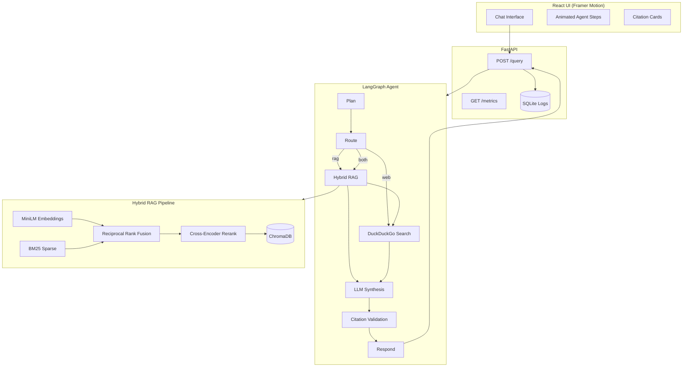

# Athena

**Autonomous research agent** that routes between a local knowledge base (hybrid RAG) and live web search, returning synthesized answers with full source citations.

Built as a portfolio-grade AI/ML project — production patterns, interview-ready comments, measurable metrics.

---

## Features

| Feature | Endpoint / UI | Why it matters |
|---------|---------------|----------------|
| **Hybrid RAG** | `athena search`, agent | Dense + BM25 + RRF + rerank |
| **LangGraph agent** | `POST /query` | Explicit Plan → Route → Retrieve → Cite pipeline |
| **SSE streaming** | `POST /query/stream` | Live agent steps in the UI |
| **Route override** | Sidebar: Auto / KB / Web / Both | Force routing for demos |
| **Document upload** | `POST /documents/upload`, drag-drop sidebar | Ingest PDFs without CLI |
| **Query history** | `GET /history`, History panel | SQLite-backed audit log |
| **Faithfulness score** | Per-answer badge | % of claims with inline `[n]` citations |
| **Raw retrieval** | `POST /search` | Debug RAG without LLM |
| **Export sessions** | Export markdown button | Drop into portfolio / reports |
| **Metrics dashboard** | `GET /metrics`, slide-out panel | Latency, routes, precision@1 |
| **Vesper landing** | `/` | Motion-design marketing page |

---

## API Reference

```
POST /query              Full agent answer + citations
POST /query/stream       SSE — step events then final answer
POST /search             Raw hybrid retrieval (no LLM)
POST /documents/upload   Upload PDF/TXT/MD → ingest
GET  /documents          List ingested documents
GET  /history            Recent queries from SQLite
GET  /metrics            Aggregated stats
GET  /health             Status + doc count
```

---

## Problem Statement

LLMs hallucinate and can't cite sources. Pure RAG misses keywords and current events. Athena solves both:

1. **Hybrid retrieval** (dense + BM25 + RRF + reranking) over your documents
2. **Intelligent routing** to web search when freshness matters
3. **LangGraph agent** with explicit Plan → Route → Retrieve → Synthesize → Cite → Respond states
4. **Every answer cited** — inline `[1]` references mapped to document pages or URLs

---

## Architecture



---

## Quick Start

### Prerequisites
- Python 3.11+
- Node.js 18+ (for UI)
- Optional: [Ollama](https://ollama.ai) for local LLM, or `OPENAI_API_KEY` for GPT

### Install

```bash
# Backend
python3 -m venv .venv && source .venv/bin/activate
pip install -e ".[dev]"

# Ingest sample documents
athena ingest

# Frontend
cd frontend && npm install && cd ..
```

### Run

```bash
# Terminal 1 — API
athena-serve

# Terminal 2 — UI (with hot reload)
cd frontend && npm run dev
```

Open **http://localhost:5173**

Or use the combined script:
```bash
chmod +x scripts/start.sh && ./scripts/start.sh
```

---

## Example Queries

| Query | Route | What happens |
|-------|-------|--------------|
| "What is hybrid retrieval?" | `rag` | Searches local KB, returns cited chunks |
| "Latest AI news 2026" | `both` | Local docs + DuckDuckGo web results |
| "What is reciprocal rank fusion?" | `rag` | BM25 + vector fusion, cross-encoder rerank |

---

## Metrics

> Metrics are **computed, not fabricated**. Run the commands below on your machine.

| Metric | How to measure | Status |
|--------|----------------|--------|
| Retrieval Precision@1 | `athena eval` | Run after ingesting your docs |
| Retrieval Recall@k | `athena eval` | Run after ingesting your docs |
| Avg latency/query | `GET /metrics` or UI panel | Logged after each query |
| Avg tokens/query | `GET /metrics` | Logged after each query |
| Cost/query | $0 with local embeddings + extractive/Ollama | — |
| Citation faithfulness | `src/athena/eval/faithfulness.py` | Heuristic check on `[n]` refs |

**Sample eval** (on bundled `sample_rag_guide.md`, 5 questions):
```
Precision@1: 1.00  (small labeled set — expand for real estimates)
MRR:         1.00
```

---

## Project Structure

```
athena/
├── config/default.yaml       # All tunables
├── src/athena/
│   ├── pipeline/             # Composable stage orchestrator
│   ├── ingestion/            # PDF/TXT → chunks → ChromaDB
│   ├── retrieval/            # Hybrid RAG (dense+BM25+RRF+rerank)
│   ├── agent/                # LangGraph state machine
│   ├── api/                  # FastAPI + SQLite logging
│   └── eval/                 # precision@k, faithfulness
├── frontend/                 # React + Framer Motion UI
├── data/raw/                 # Drop your PDFs here
├── data/eval/qa_pairs.json   # Labeled eval set
└── scripts/start.sh
```

---

## Key Design Decisions

| Decision | Choice | Why |
|----------|--------|-----|
| Embeddings | `all-MiniLM-L6-v2` (local) | Free, offline, reproducible |
| Vector store | ChromaDB | Local persistence, metadata filtering |
| Retrieval | Hybrid dense + BM25 | Catches semantic + keyword matches |
| Fusion | Reciprocal Rank Fusion | No score normalization between rankers |
| Reranker | Cross-encoder ms-marco | Production retrieve-then-rerank pattern |
| Agent | LangGraph explicit states | Whiteboard-explainable, testable nodes |
| Web search | DuckDuckGo | Free, no API key for portfolio demos |
| LLM | Ollama / OpenAI / extractive | Configurable; extractive works without keys |
| UI | React + Framer Motion | Motion-site aesthetic — animated pipeline, glass morphism |
| Logging | SQLite | Structured aggregation for metrics |

---

## LLM Configuration

Edit `config/default.yaml`:

```yaml
llm:
  provider: extractive  # or: ollama, openai
  model: llama3.2       # for ollama
  openai_model: gpt-4o-mini
```

- **extractive** — No API key; stitches top RAG chunks with citations
- **ollama** — `ollama pull llama3.2` then set `provider: ollama`
- **openai** — Set `OPENAI_API_KEY` and `provider: openai`

---

## What I'd Improve With More Time

1. **Streaming responses** — SSE token stream from LLM to UI
2. **Paid embedding A/B test** — Compare MiniLM vs `text-embedding-3-small` on eval set
3. **NLI faithfulness model** — Replace heuristic citation check with DeBERTa NLI
4. **Persistent agent memory** — Redis/Postgres checkpointing instead of in-memory
5. **Document upload UI** — Drag-and-drop ingestion from the frontend
6. **Tavily/SerpAPI** — More reliable web search for production
7. **Multi-modal ingestion** — Images, tables via unstructured.io

---

## CLI Reference

```bash
athena ingest              # Run ingestion pipeline
athena search "query"      # Test hybrid retrieval
athena eval                # Retrieval metrics
athena status              # Registry + vector store stats
athena-serve               # Start FastAPI server
```

---

## License

MIT
